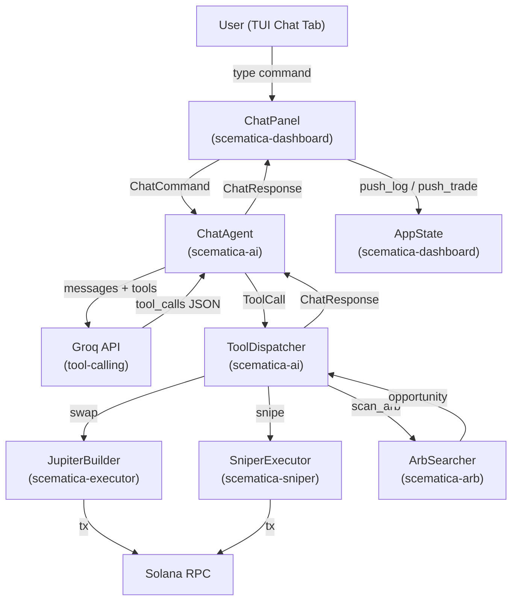
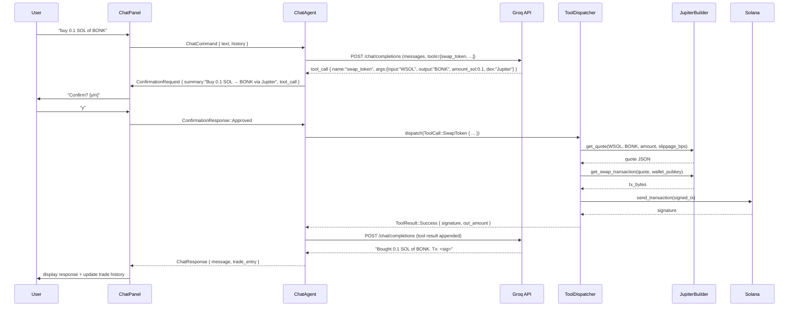
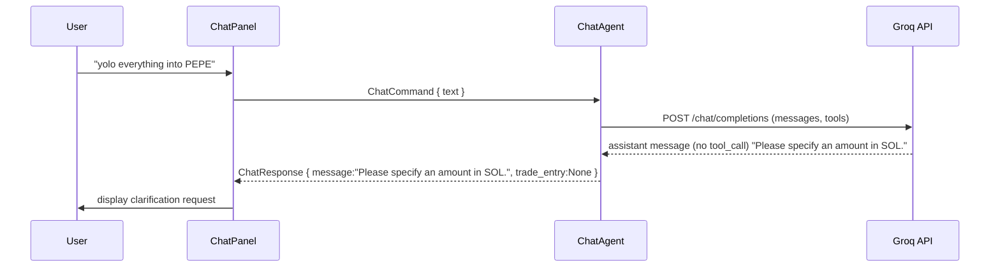

# Design Document: Chat Trading Interface

## Overview

A natural language chat interface embedded in the Scematica TUI dashboard that lets users issue trading commands in plain English. The system uses Groq's tool-calling API (function calling) to parse user intent and dispatch to the appropriate executor functions — covering spot swaps via Jupiter, sniper triggers, arb scans, and bot mode changes — with a confirmation step before any real transaction is submitted.

The feature extends `scematica-dashboard` with a new "Chat" tab and adds a `ChatAgent` to `scematica-ai` that owns the Groq tool-calling loop. No new crate is required; the chat agent lives in `scematica-ai` and the TUI panel lives in `scematica-dashboard`.

---

## Architecture



---

## Sequence Diagrams

### Happy Path: "buy 0.1 SOL of BONK"



### Rejection / Clarification Path



---

## Components and Interfaces

### Component 1: `ChatAgent` (scematica-ai/src/chat_agent.rs)

**Purpose**: Owns the Groq tool-calling conversation loop. Converts user text into structured `ToolCall` variants, manages multi-turn history, and returns human-readable responses.

**Interface**:
```rust
pub struct ChatAgent {
    client: AiClient,
    tools: Vec<ToolDefinition>,   // JSON schema definitions sent to Groq
    history: Vec<ChatMessage>,    // rolling conversation window (max 20 turns)
}

impl ChatAgent {
    pub fn new(client: AiClient) -> Self;

    /// Process a user message. Returns either a ConfirmationRequest (tool call
    /// detected) or a plain ChatResponse (clarification / info reply).
    pub async fn process(
        &mut self,
        user_text: &str,
    ) -> Result<AgentOutput>;

    /// Called after user confirms. Executes the pending tool call and returns
    /// the final natural-language response.
    pub async fn execute_confirmed(
        &mut self,
        tool_call: PendingToolCall,
        dispatcher: &ToolDispatcher,
    ) -> Result<ChatResponse>;

    /// Clear conversation history (e.g. on /clear command)
    pub fn reset_history(&mut self);
}

pub enum AgentOutput {
    /// Groq returned a tool call — needs user confirmation before execution
    NeedsConfirmation(PendingToolCall),
    /// Groq returned a plain text reply (clarification, info, error)
    Reply(ChatResponse),
}
```

**Responsibilities**:
- Build the `tools` array from `ToolDefinition` structs and include it in every request
- Parse `tool_calls` from Groq's response (finish_reason == "tool_calls")
- Maintain rolling conversation history (system + last N turns)
- Never execute a trade without going through `execute_confirmed`

---

### Component 2: `ToolDispatcher` (scematica-ai/src/tool_dispatcher.rs)

**Purpose**: Maps `ToolCall` enum variants to actual executor calls. Holds `Arc` references to the executor, sniper, and arb engine so it can be shared across async tasks.

**Interface**:
```rust
pub struct ToolDispatcher {
    rpc: Arc<RpcClient>,
    wallet: Arc<Wallet>,
    config: Arc<BotConfig>,
}

impl ToolDispatcher {
    pub fn new(rpc: Arc<RpcClient>, wallet: Arc<Wallet>, config: Arc<BotConfig>) -> Self;

    pub async fn dispatch(&self, call: ToolCall) -> Result<ToolResult>;
}

pub enum ToolCall {
    SwapToken {
        input_mint_symbol: String,   // "WSOL", "USDC", etc.
        output_mint_symbol: String,
        amount_sol: f64,
        dex: String,                 // "Jupiter" | "Raydium" | "auto"
        slippage_bps: u16,
    },
    GetQuote {
        input_mint_symbol: String,
        output_mint_symbol: String,
        amount_sol: f64,
    },
    GetBalance,
    SetBotMode {
        mode: String,  // "idle" | "sniper" | "arb" | "both"
    },
    ScanArb {
        max_hops: usize,
    },
    GetTradeHistory {
        limit: usize,
    },
    GetBotStatus,
}

pub enum ToolResult {
    Success {
        message: String,
        signature: Option<String>,
        data: Option<serde_json::Value>,
    },
    Failure {
        message: String,
        recoverable: bool,
    },
}
```

**Responsibilities**:
- Resolve token symbols to `Pubkey` using `known_tokens` and a symbol→mint lookup table
- Route `SwapToken` to `JupiterBuilder::get_swap_transaction` (default) or direct DEX builders
- Route `GetQuote` to `JupiterBuilder::get_quote` without signing
- Route `SetBotMode` to update `AppState::active_mode`
- Route `ScanArb` to the arb searcher
- Sign and submit transactions using the wallet keypair

---

### Component 3: `ChatPanel` (scematica-dashboard/src/chat.rs)

**Purpose**: Ratatui widget that renders the chat history, input box, and confirmation prompt. Handles keyboard input for the chat tab.

**Interface**:
```rust
pub struct ChatPanel {
    pub messages: VecDeque<ChatLine>,  // display history
    pub input_buffer: String,
    pub state: ChatPanelState,
    pub scroll_offset: usize,
}

pub enum ChatPanelState {
    Idle,
    WaitingForResponse,
    WaitingForConfirmation(PendingToolCall),
}

pub struct ChatLine {
    pub role: ChatLineRole,   // User | Assistant | System | Error
    pub text: String,
    pub timestamp: DateTime<Utc>,
}

pub enum ChatLineRole {
    User,
    Assistant,
    System,
    Error,
}

impl ChatPanel {
    pub fn new() -> Self;
    pub fn push_line(&mut self, role: ChatLineRole, text: impl Into<String>);
    pub fn render(&self, f: &mut Frame, area: Rect);
    pub fn handle_key(&mut self, key: KeyEvent) -> Option<ChatPanelAction>;
}

pub enum ChatPanelAction {
    Submit(String),           // user pressed Enter with non-empty buffer
    Confirm,                  // user pressed 'y' during confirmation
    Reject,                   // user pressed 'n' during confirmation
    ScrollUp,
    ScrollDown,
    Clear,                    // user typed /clear
}
```

**Responsibilities**:
- Render a scrollable message history pane and a single-line input box
- Show a highlighted confirmation banner when `state == WaitingForConfirmation`
- Capture character input only when the Chat tab is active
- Emit `ChatPanelAction` events to the main event loop

---

### Component 4: Tool Definitions (scematica-ai/src/tool_definitions.rs)

**Purpose**: Static JSON schema definitions for all tools sent to Groq. Centralised so they can be updated without touching agent logic.

**Interface**:
```rust
pub struct ToolDefinition {
    pub name: &'static str,
    pub description: &'static str,
    pub parameters: serde_json::Value,  // JSON Schema object
}

pub fn all_tools() -> Vec<ToolDefinition>;
```

Tools exposed to Groq:

| Tool name | Description |
|---|---|
| `swap_token` | Execute a token swap on a Solana DEX |
| `get_quote` | Get a price quote without executing |
| `get_balance` | Return current SOL and token balances |
| `set_bot_mode` | Switch the bot between idle/sniper/arb/both |
| `scan_arb` | Trigger an on-demand arbitrage scan |
| `get_trade_history` | Return recent trade records |
| `get_bot_status` | Return current metrics and mode |

---

## Data Models

### `PendingToolCall`

```rust
#[derive(Debug, Clone, Serialize, Deserialize)]
pub struct PendingToolCall {
    /// Groq-assigned call ID (used when submitting tool result back)
    pub call_id: String,
    /// Parsed tool call variant
    pub call: ToolCall,
    /// Human-readable summary shown to user for confirmation
    pub summary: String,
    /// Risk level — drives confirmation UX colour
    pub risk: RiskLevel,
}

#[derive(Debug, Clone, Copy, PartialEq, Eq)]
pub enum RiskLevel {
    /// Read-only (quotes, status, history) — no confirmation needed
    Safe,
    /// Modifies bot state (mode change) — single confirmation
    Moderate,
    /// Submits a transaction — explicit y/n confirmation
    High,
}
```

**Validation Rules**:
- `amount_sol` must be > 0.0 and ≤ wallet SOL balance
- `slippage_bps` must be in range 1–2000 (0.01%–20%)
- `dex` must be one of: "Jupiter", "Raydium", "Orca", "Meteora", "auto"
- `mode` must be one of: "idle", "sniper", "arb", "both"
- `max_hops` must be 2 or 3

### `ChatResponse`

```rust
#[derive(Debug, Clone)]
pub struct ChatResponse {
    /// Natural language reply from the model (post tool-result)
    pub message: String,
    /// If a trade was executed, the resulting entry for the dashboard
    pub trade_entry: Option<TradeEntry>,
    /// Token usage for this turn
    pub tokens_used: u32,
}
```

### `ConversationHistory`

```rust
/// Rolling window of messages sent to Groq
pub struct ConversationHistory {
    system_prompt: ChatMessage,
    turns: VecDeque<ChatMessage>,
    max_turns: usize,   // default: 20
}

impl ConversationHistory {
    pub fn push_user(&mut self, text: &str);
    pub fn push_assistant(&mut self, content: &str);
    pub fn push_tool_call(&mut self, call_id: &str, name: &str, args: &str);
    pub fn push_tool_result(&mut self, call_id: &str, result: &str);
    pub fn as_messages(&self) -> Vec<ChatMessage>;
}
```

---

## Algorithmic Pseudocode

### Main Chat Processing Loop

```pascal
ALGORITHM process_user_message(agent, user_text, dispatcher)
INPUT: agent: ChatAgent, user_text: String, dispatcher: ToolDispatcher
OUTPUT: AgentOutput

BEGIN
  // Step 1: Append user turn to history
  agent.history.push_user(user_text)

  // Step 2: Build Groq request with tools
  request ← build_tool_calling_request(
    model = "llama-3.3-70b-versatile",
    messages = agent.history.as_messages(),
    tools = agent.tools,
    tool_choice = "auto"
  )

  // Step 3: Call Groq API
  response ← agent.client.chat(request).await?

  // Step 4: Branch on finish_reason
  IF response.finish_reason = "tool_calls" THEN
    tool_call_json ← response.tool_calls[0]
    parsed ← parse_tool_call(tool_call_json)

    // Append assistant tool-call message to history
    agent.history.push_tool_call(parsed.call_id, parsed.name, parsed.args)

    risk ← classify_risk(parsed.call)

    IF risk = Safe THEN
      // Execute immediately, no confirmation needed
      result ← dispatcher.dispatch(parsed.call).await
      agent.history.push_tool_result(parsed.call_id, result.to_json())
      final_response ← agent.client.chat(follow_up_request).await?
      RETURN AgentOutput::Reply(ChatResponse { message: final_response.content })
    ELSE
      pending ← PendingToolCall {
        call_id: parsed.call_id,
        call: parsed.call,
        summary: build_summary(parsed.call),
        risk
      }
      RETURN AgentOutput::NeedsConfirmation(pending)
    END IF

  ELSE IF response.finish_reason = "stop" THEN
    // Plain text reply — clarification or info
    agent.history.push_assistant(response.content)
    RETURN AgentOutput::Reply(ChatResponse { message: response.content })

  ELSE
    RETURN AgentOutput::Reply(ChatResponse { message: "Unexpected response from AI." })
  END IF
END
```

**Preconditions**:
- `user_text` is non-empty
- `agent.client` is connected and authenticated
- `agent.history` has not exceeded `max_turns` (trimmed if needed)

**Postconditions**:
- `agent.history` contains the new user turn and assistant response
- If `NeedsConfirmation` returned, no transaction has been submitted
- If `Reply` returned for a Safe tool, the tool result is in history

**Loop Invariants**: N/A (no loops in this algorithm)

---

### Tool Execution After Confirmation

```pascal
ALGORITHM execute_confirmed(agent, pending, dispatcher)
INPUT: pending: PendingToolCall, dispatcher: ToolDispatcher
OUTPUT: ChatResponse

BEGIN
  // Step 1: Execute the tool
  result ← dispatcher.dispatch(pending.call).await

  // Step 2: Append tool result to history
  agent.history.push_tool_result(pending.call_id, result.to_json())

  // Step 3: Ask Groq to summarise the result in natural language
  follow_up ← build_follow_up_request(agent.history.as_messages())
  final_response ← agent.client.chat(follow_up).await?

  agent.history.push_assistant(final_response.content)

  // Step 4: Build trade entry if a swap was executed
  trade_entry ← IF result IS Success AND pending.call IS SwapToken THEN
    build_trade_entry(pending.call, result)
  ELSE
    None
  END IF

  RETURN ChatResponse {
    message: final_response.content,
    trade_entry,
    tokens_used: final_response.usage.total_tokens
  }
END
```

**Preconditions**:
- `pending` was returned by a prior `process_user_message` call
- User has explicitly confirmed execution

**Postconditions**:
- If `result` is `Success` and call is `SwapToken`, a `TradeEntry` is returned for the dashboard
- `agent.history` is updated with tool result and final assistant message
- Transaction signature is included in `ChatResponse.message`

---

### Token Symbol Resolution

```pascal
ALGORITHM resolve_symbol(symbol)
INPUT: symbol: String (e.g. "BONK", "SOL", "USDC")
OUTPUT: Pubkey OR Error

BEGIN
  // Normalise
  upper ← symbol.to_uppercase()

  // Check well-known tokens first
  IF upper = "SOL" OR upper = "WSOL" THEN
    RETURN known_tokens::WSOL_MINT
  ELSE IF upper = "USDC" THEN
    RETURN known_tokens::USDC_MINT
  ELSE IF upper = "USDT" THEN
    RETURN known_tokens::USDT_MINT
  ELSE IF upper = "BONK" THEN
    RETURN known_tokens::BONK_MINT
  ELSE IF upper = "RAY" THEN
    RETURN known_tokens::RAY_MINT
  END IF

  // Try parsing as raw base58 pubkey
  IF is_valid_pubkey(symbol) THEN
    RETURN Pubkey::from_str(symbol)
  END IF

  // Fall back to Jupiter token list lookup (HTTP)
  result ← jupiter_token_list_lookup(upper).await
  IF result IS Some(pubkey) THEN
    RETURN pubkey
  END IF

  RETURN Error("Unknown token symbol: {symbol}")
END
```

**Preconditions**:
- `symbol` is a non-empty string

**Postconditions**:
- Returns a valid `Pubkey` or a descriptive error
- Well-known tokens are resolved without network calls

---

## Key Functions with Formal Specifications

### `ChatAgent::process`

```rust
pub async fn process(&mut self, user_text: &str) -> Result<AgentOutput>
```

**Preconditions**:
- `user_text.len() > 0`
- `self.client` is initialised with a valid Groq API key
- `self.history.turns.len() <= self.history.max_turns`

**Postconditions**:
- `self.history` contains the new user message
- If `Ok(AgentOutput::NeedsConfirmation(_))`: no side effects on Solana
- If `Ok(AgentOutput::Reply(_))`: history contains assistant response
- If `Err(_)`: history is rolled back to pre-call state

**Loop Invariants**: N/A

---

### `ToolDispatcher::dispatch`

```rust
pub async fn dispatch(&self, call: ToolCall) -> Result<ToolResult>
```

**Preconditions**:
- All token symbols in `call` resolve to valid `Pubkey`s
- For `SwapToken`: `amount_sol > 0.0` and wallet has sufficient balance
- For `SetBotMode`: `mode` is one of the valid enum variants

**Postconditions**:
- `SwapToken` → transaction submitted to Solana; `ToolResult::Success.signature` is `Some`
- `GetQuote` → no transaction submitted; quote data in `ToolResult::Success.data`
- `SetBotMode` → `AppState::active_mode` updated atomically
- On any RPC error → `ToolResult::Failure { recoverable: true }`
- On invalid input → `ToolResult::Failure { recoverable: false }`

**Loop Invariants**: N/A

---

### `ChatPanel::handle_key`

```rust
pub fn handle_key(&mut self, key: KeyEvent) -> Option<ChatPanelAction>
```

**Preconditions**:
- Called only when the Chat tab is the active tab

**Postconditions**:
- `Enter` with non-empty `input_buffer` → `Some(ChatPanelAction::Submit(buffer))` and `input_buffer` cleared
- `Enter` with empty buffer → `None`
- `'y'` when `state == WaitingForConfirmation` → `Some(ChatPanelAction::Confirm)`
- `'n'` when `state == WaitingForConfirmation` → `Some(ChatPanelAction::Reject)`
- All other keys during `WaitingForResponse` → `None` (input blocked)
- Character keys during `Idle` → appended to `input_buffer`, returns `None`

**Loop Invariants**: N/A

---

## Error Handling

### Error Scenario 1: Groq API Timeout / Rate Limit

**Condition**: `AiClient::chat` returns an error (network timeout, 429, 503)
**Response**: `ChatAgent::process` returns `Err`; the panel displays "AI service unavailable, please try again."
**Recovery**: User can retry; history is not corrupted (user message is rolled back on error)

### Error Scenario 2: Unknown Token Symbol

**Condition**: `resolve_symbol` cannot find the token after checking known tokens and Jupiter list
**Response**: `ToolDispatcher::dispatch` returns `ToolResult::Failure { recoverable: false, message: "Unknown token: XYZ" }`; Groq is given the failure result and generates a helpful clarification ("Did you mean BONK?")
**Recovery**: User provides a corrected symbol or a raw mint address

### Error Scenario 3: Insufficient Balance

**Condition**: `amount_sol` exceeds wallet SOL balance at dispatch time
**Response**: `ToolDispatcher::dispatch` returns `ToolResult::Failure { recoverable: false, message: "Insufficient balance: have X SOL, need Y SOL" }`
**Recovery**: User issues a smaller amount or tops up wallet

### Error Scenario 4: Transaction Simulation Failure

**Condition**: Jupiter or Solana RPC rejects the transaction during simulation
**Response**: `ToolResult::Failure { recoverable: true, message: "Transaction simulation failed: <reason>" }`
**Recovery**: User can retry; the agent suggests adjusting slippage if the error is slippage-related

### Error Scenario 5: User Rejects Confirmation

**Condition**: User presses 'n' at the confirmation prompt
**Response**: `ChatPanel` emits `ChatPanelAction::Reject`; the pending tool call is discarded; panel shows "Trade cancelled."
**Recovery**: User can issue a new command; history is preserved

---

## Testing Strategy

### Unit Testing Approach

- `ChatAgent::process` with mocked `AiClient` returning pre-canned tool-call JSON and plain-text responses
- `ToolDispatcher::dispatch` with mocked `RpcClient` and `JupiterBuilder` for each `ToolCall` variant
- `resolve_symbol` for all known tokens, valid pubkey strings, and unknown symbols
- `ChatPanel::handle_key` for all key sequences and state transitions
- `ConversationHistory` push/trim behaviour at the max-turns boundary

### Property-Based Testing Approach

**Property Test Library**: `proptest`

- **History window invariant**: For any sequence of N push operations, `history.as_messages().len() <= max_turns + 1` (system prompt always present)
- **Symbol resolution idempotency**: `resolve_symbol(resolve_symbol(s).to_string()) == resolve_symbol(s)` for all valid symbols
- **Confirmation gate**: For any `ToolCall` with `risk != Safe`, `process` never calls `dispatcher.dispatch` — only `execute_confirmed` does
- **Input buffer**: For any sequence of character key events, `input_buffer` equals the concatenation of those characters (no dropped or duplicated chars)

### Integration Testing Approach

- End-to-end: mock Groq returning `swap_token` tool call → confirm → mock Jupiter returning quote + tx → mock RPC accepting tx → verify `TradeEntry` pushed to `AppState`
- Conversation multi-turn: send 3 messages, verify history length and that system prompt is always first

---

## Performance Considerations

- Groq LPU inference is fast (~200ms for tool-call responses on llama-3.3-70b); the TUI shows a spinner during `WaitingForResponse` to keep the UI responsive
- `ConversationHistory` is capped at 20 turns to bound token usage per request (~4K tokens max context sent)
- `resolve_symbol` caches Jupiter token list in memory after first fetch (lazy-loaded `OnceLock<HashMap<String, Pubkey>>`) to avoid repeated HTTP calls
- All async work (Groq call, RPC call) runs on the Tokio runtime; the TUI render loop is never blocked — `ChatAgent::process` is called via `tokio::spawn` and the result sent back on an `mpsc` channel

---

## Security Considerations

- **Confirmation gate**: Every `ToolCall` with `risk >= Moderate` requires explicit user confirmation before `ToolDispatcher::dispatch` is called. The AI model cannot bypass this gate.
- **Amount clamping**: `amount_sol` is validated against the live wallet balance before dispatch; the AI cannot instruct the bot to spend more than it has.
- **Slippage bounds**: `slippage_bps` is clamped to 1–2000 regardless of what the model returns.
- **No prompt injection via tool results**: Tool results are serialised as JSON and inserted as `role: "tool"` messages, not as user messages, preventing prompt injection from on-chain data.
- **API key**: `GROQ_API_KEY` is read from `.env` via `dotenv` and never logged or included in chat history.
- **Read-only tools are Safe**: `GetQuote`, `GetBalance`, `GetTradeHistory`, `GetBotStatus` are classified `RiskLevel::Safe` and execute without confirmation, but they never submit transactions.

---

## Dependencies

### New dependencies required

| Crate | Version | Used in | Purpose |
|---|---|---|---|
| No new crates needed | — | — | All required deps already in workspace |

### Existing dependencies used

- `scematica-ai`: `AiClient`, `ChatMessage`, `AiRequest` — extended with tool-calling fields
- `scematica-executor`: `JupiterBuilder` — for swap execution and quotes
- `scematica-core`: `known_tokens`, `BotConfig`, `Wallet`, `TradeEntry` types
- `scematica-dashboard`: `AppState`, `ratatui`, `crossterm` — for the chat panel UI
- `reqwest` (workspace) — Jupiter token list HTTP lookup
- `serde_json` (workspace) — tool definition schemas and tool result serialisation
- `tokio::sync::mpsc` (workspace) — async channel between chat agent task and TUI loop

### Groq Tool-Calling API

The existing `AiRequest` / `AiResponse` types in `scematica-ai/src/types.rs` need two additions:

```rust
// Added to AiRequest
#[serde(skip_serializing_if = "Option::is_none")]
pub tools: Option<Vec<serde_json::Value>>,

#[serde(skip_serializing_if = "Option::is_none")]
pub tool_choice: Option<String>,  // "auto" | "none" | specific tool name

// Added to AiChoice
pub tool_calls: Option<Vec<ToolCallResponse>>,

// New type
#[derive(Debug, Clone, Deserialize)]
pub struct ToolCallResponse {
    pub id: String,
    pub r#type: String,   // "function"
    pub function: ToolCallFunction,
}

#[derive(Debug, Clone, Deserialize)]
pub struct ToolCallFunction {
    pub name: String,
    pub arguments: String,  // JSON string
}
```

These additions are backward-compatible (all new fields are `Option` with `skip_serializing_if`).
