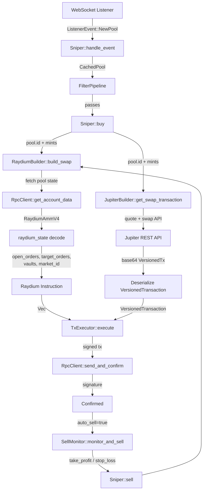
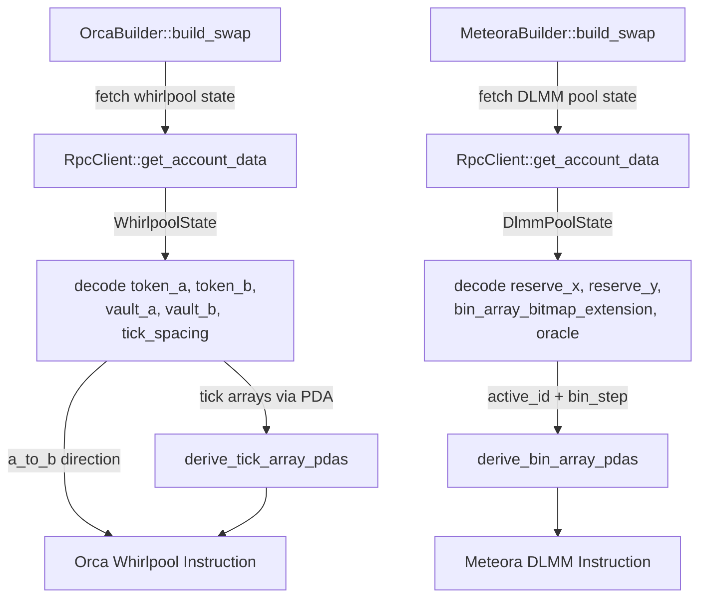
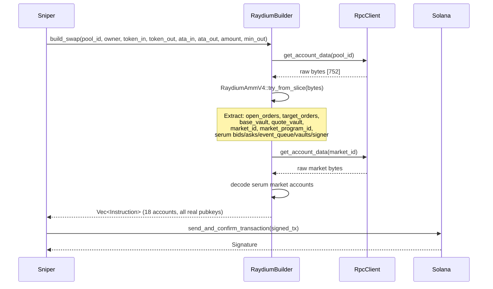
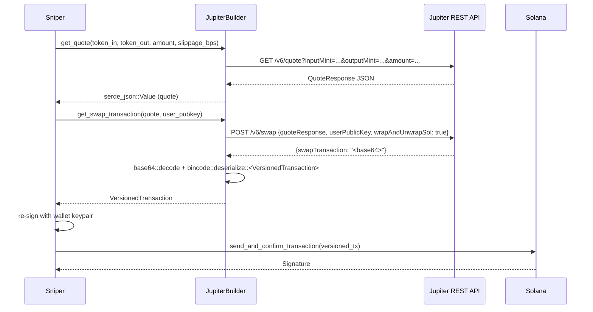

# Design Document: Live Trading Execution

## Overview

This feature completes the end-to-end trading pipeline for the Scematica Solana bot by fixing the four broken execution paths: Raydium AMM V4 swap instructions (which currently use `Pubkey::default()` placeholders for all pool-derived accounts), Orca Whirlpool swaps (which need on-chain pool state to determine token direction and vault addresses), Meteora DLMM swaps (which need bin array and reserve accounts from pool state), and Jupiter swaps (where `build_swap` returns an empty vec and the sniper must instead call `get_swap_transaction()` to obtain a versioned transaction).

The core problem is that all DEX builders currently build structurally valid instructions with wrong account addresses. A swap submitted with `Pubkey::default()` in place of the real vault or market accounts will be rejected on-chain with an `AccountNotFound` or `InvalidAccountData` error. The fix requires each builder to fetch the relevant on-chain pool state account before constructing the instruction, extract the real pubkeys, and populate the account list correctly. For Jupiter, the sniper's buy/sell path must be refactored to call `get_swap_transaction()` and deserialize the returned versioned transaction rather than going through `build_swap`.

The wallet keypair is already loading correctly from `/home/deadsg/.config/solana/id.json` via WSL UNC path. The RPC client, transaction executor (default and Jito), filter pipeline, and sniper event loop are all functional. This feature is purely about making the swap instruction construction correct so that transactions land on-chain.


## Architecture






## Sequence Diagrams

### Raydium Buy Flow



### Jupiter Buy Flow




## Components and Interfaces

### Component 1: RaydiumBuilder (scematica-executor/src/raydium.rs)

**Purpose**: Build the 18-account Raydium AMM V4 swap instruction by fetching and decoding the on-chain pool state and associated Serum/OpenBook market state.

**Interface**:
```rust
pub struct RaydiumBuilder {
    rpc: Arc<RpcClient>,
}

impl RaydiumBuilder {
    pub fn new(rpc: Arc<RpcClient>) -> Self;
}

#[async_trait]
impl SwapInstructionBuilder for RaydiumBuilder {
    fn dex(&self) -> DexKind;

    /// Fetches pool state + market state, builds the full 18-account swap instruction.
    /// Returns Err if pool account is missing, data is malformed, or RPC fails.
    async fn build_swap(
        &self,
        pool: &Pubkey,       // AMM pool state account
        owner: &Pubkey,      // wallet pubkey (signer)
        token_in: &Pubkey,   // input token mint
        token_out: &Pubkey,  // output token mint
        ata_in: &Pubkey,     // user's source ATA
        ata_out: &Pubkey,    // user's destination ATA
        amount_in: u64,
        min_amount_out: u64,
    ) -> Result<Vec<Instruction>>;
}
```

**Responsibilities**:
- Accept an `Arc<RpcClient>` at construction time (breaking change: `new()` now requires RPC)
- Call `rpc.get_account_data(pool)` and deserialize into `RaydiumAmmV4` via `BorshDeserialize`
- Call `rpc.get_account_data(state.market_id)` and decode the Serum market layout to extract bids, asks, event_queue, coin_vault, pc_vault, vault_signer
- Derive the AMM authority PDA: `Pubkey::find_program_address(&[b"amm authority"], &RAYDIUM_AMM_V4)`
- Derive the Serum vault signer: `Pubkey::create_program_address(&[market_id.as_ref(), &nonce.to_le_bytes()], &market_program_id)`
- Populate all 18 account metas with real pubkeys and return the instruction

### Component 2: OrcaBuilder (scematica-executor/src/orca.rs)

**Purpose**: Build the Orca Whirlpool swap instruction by fetching pool state to determine token direction, vault addresses, and deriving tick array PDAs.

**Interface**:
```rust
pub struct OrcaBuilder {
    rpc: Arc<RpcClient>,
}

#[async_trait]
impl SwapInstructionBuilder for OrcaBuilder {
    async fn build_swap(
        &self,
        pool: &Pubkey,       // Whirlpool account
        owner: &Pubkey,
        token_in: &Pubkey,
        token_out: &Pubkey,
        ata_in: &Pubkey,
        ata_out: &Pubkey,
        amount_in: u64,
        min_amount_out: u64,
    ) -> Result<Vec<Instruction>>;
}
```

**Responsibilities**:
- Fetch and decode Whirlpool state (272 bytes): extract `token_mint_a`, `token_mint_b`, `token_vault_a`, `token_vault_b`, `tick_current_index`, `tick_spacing`, `sqrt_price`
- Determine `a_to_b`: `token_in == token_mint_a`
- Derive oracle PDA: `Pubkey::find_program_address(&[b"oracle", pool.as_ref()], &ORCA_WHIRLPOOL)`
- Derive 3 tick array PDAs based on `tick_current_index`, `tick_spacing`, and direction
- Set `sqrt_price_limit` to `MIN_SQRT_PRICE` (a→b) or `MAX_SQRT_PRICE` (b→a)
- Build the 11-account instruction with all real pubkeys

### Component 3: MeteoraBuilder (scematica-executor/src/meteora.rs)

**Purpose**: Build the Meteora DLMM swap instruction by fetching pool state to get reserve accounts, bin array bitmap extension, oracle, and deriving active bin array PDAs.

**Interface**:
```rust
pub struct MeteoraBuilder {
    rpc: Arc<RpcClient>,
}

#[async_trait]
impl SwapInstructionBuilder for MeteoraBuilder {
    async fn build_swap(
        &self,
        pool: &Pubkey,
        owner: &Pubkey,
        token_in: &Pubkey,
        token_out: &Pubkey,
        ata_in: &Pubkey,
        ata_out: &Pubkey,
        amount_in: u64,
        min_amount_out: u64,
    ) -> Result<Vec<Instruction>>;
}
```

**Responsibilities**:
- Fetch and decode DLMM LbPair state: extract `reserve_x`, `reserve_y`, `token_x_mint`, `token_y_mint`, `active_id`, `bin_step`, `oracle`, `bin_array_bitmap_extension`
- Determine `swap_for_y`: `token_in == token_x_mint`
- Derive 2 bin array PDAs around `active_id` using `Pubkey::find_program_address(&[b"bin_array", pool.as_ref(), &bin_array_index.to_le_bytes()], &METEORA_DLMM)`
- Build the 14-account instruction

### Component 4: JupiterBuilder (scematica-executor/src/jupiter.rs)

**Purpose**: Provide Jupiter V6 swap support. `build_swap` is intentionally a no-op; callers use `get_quote` + `get_swap_transaction` to obtain a `VersionedTransaction` directly.

**Interface**:
```rust
pub struct JupiterBuilder {
    http_client: reqwest::Client,
    api_url: String,
}

impl JupiterBuilder {
    pub fn new() -> Self;

    /// Step 1: Get optimal route quote
    pub async fn get_quote(
        &self,
        input_mint: &Pubkey,
        output_mint: &Pubkey,
        amount: u64,
        slippage_bps: u16,
    ) -> Result<serde_json::Value>;

    /// Step 2: Get signed versioned transaction bytes
    pub async fn get_swap_transaction(
        &self,
        quote: &serde_json::Value,
        user_public_key: &Pubkey,
    ) -> Result<Vec<u8>>;

    /// Step 3: Deserialize and re-sign the transaction
    pub fn deserialize_transaction(
        &self,
        tx_bytes: &[u8],
    ) -> Result<VersionedTransaction>;
}
```

**Responsibilities**:
- `get_quote`: HTTP GET to `/v6/quote` with `wrapAndUnwrapSol=true` implied
- `get_swap_transaction`: HTTP POST to `/v6/swap` with `wrapAndUnwrapSol: true`, `dynamicComputeUnitLimit: true`, `prioritizationFeeLamports: "auto"`
- `deserialize_transaction`: `bincode::deserialize::<VersionedTransaction>(tx_bytes)` — the returned tx is pre-signed by Jupiter's fee account; the user must add their own signature

### Component 5: Sniper Jupiter Integration (scematica-sniper/src/sniper.rs)

**Purpose**: Route Jupiter-pool swaps through `get_swap_transaction` instead of `build_swap`, and handle the resulting `VersionedTransaction` in the executor.

**Responsibilities**:
- Detect when `pool.dex == DexKind::Jupiter` (or when the sniper is configured to use Jupiter as the execution route)
- Call `jupiter_builder.get_quote(...)` then `get_swap_transaction(...)` then `deserialize_transaction(...)`
- Re-sign the versioned transaction with the wallet keypair
- Pass the versioned transaction to `TxExecutor::execute_versioned` (new method on the trait)

### Component 6: SwapInstructionBuilder factory (scematica-executor/src/lib.rs)

**Purpose**: The `get_builder` factory must be updated to accept an `Arc<RpcClient>` since all builders now require RPC access.

**Interface**:
```rust
pub fn get_builder(
    dex: DexKind,
    rpc: Arc<RpcClient>,
) -> Option<Box<dyn SwapInstructionBuilder>>;
```


## Data Models

### Raydium AMM V4 Pool State (existing — `raydium_state.rs`)

The `RaydiumAmmV4` struct already exists and is correct. The key fields needed for instruction building are:

```rust
pub struct RaydiumAmmV4 {
    // ... (fields at offsets 0–335 are fee/config params)
    pub base_vault: Pubkey,         // offset 336 — pool's base token vault
    pub quote_vault: Pubkey,        // offset 368 — pool's quote token vault
    pub base_mint: Pubkey,          // offset 400
    pub quote_mint: Pubkey,         // offset 432
    pub lp_mint: Pubkey,            // offset 464
    pub open_orders: Pubkey,        // offset 496 — Serum open orders account
    pub market_id: Pubkey,          // offset 528 — Serum/OpenBook market
    pub market_program_id: Pubkey,  // offset 560 — Serum program (DEX v3 or OpenBook)
    pub target_orders: Pubkey,      // offset 592
    // ...
}
```

**Validation Rules**:
- `data.len() >= RaydiumAmmV4::LEN` (752 bytes) before deserializing
- `state.status != 0` — pool must be initialized (status 6 = SwapOnly, status 1 = Initialized)
- `state.base_vault != Pubkey::default()` — vault must be populated

### Serum/OpenBook Market State

The market state is a fixed-layout account. The fields needed are at known byte offsets (Serum DEX v3 layout):

```rust
// Byte offsets within the market account data (after 5-byte header)
pub struct SerumMarketLayout {
    // offset 5+0:   own_address (32 bytes)
    // offset 5+32:  vault_signer_nonce (8 bytes) — u64
    // offset 5+40:  base_mint (32 bytes)
    // offset 5+72:  quote_mint (32 bytes)
    // offset 5+104: base_vault (32 bytes)
    // offset 5+136: base_deposits_total (8 bytes)
    // offset 5+144: base_fees_accrued (8 bytes)
    // offset 5+152: quote_vault (32 bytes)
    // offset 5+184: quote_deposits_total (8 bytes)
    // offset 5+192: quote_fees_accrued (8 bytes)
    // offset 5+200: quote_dust_threshold (8 bytes)
    // offset 5+208: request_queue (32 bytes)
    // offset 5+240: event_queue (32 bytes)
    // offset 5+272: bids (32 bytes)
    // offset 5+304: asks (32 bytes)
    // offset 5+336: base_lot_size (8 bytes)
    // offset 5+344: quote_lot_size (8 bytes)
    // offset 5+352: fee_rate_bps (8 bytes)
    // offset 5+360: referrer_rebates_accrued (8 bytes)
}
```

**Vault signer derivation**:
```rust
fn derive_serum_vault_signer(market_id: &Pubkey, nonce: u64, program_id: &Pubkey) -> Result<Pubkey> {
    Pubkey::create_program_address(
        &[market_id.as_ref(), &nonce.to_le_bytes()],
        program_id,
    ).map_err(Into::into)
}
```

### Orca Whirlpool State

```rust
// Whirlpool account layout (272 bytes, Anchor-serialized)
// Discriminator: 8 bytes
// whirlpools_config: Pubkey (32)
// whirlpool_bump: [u8; 1]
// tick_spacing: u16
// tick_spacing_seed: [u8; 2]
// fee_rate: u16
// protocol_fee_rate: u16
// liquidity: u128
// sqrt_price: u128
// tick_current_index: i32
// protocol_fee_owed_a: u64
// protocol_fee_owed_b: u64
// token_mint_a: Pubkey (32)
// token_vault_a: Pubkey (32)
// fee_growth_global_a: u128
// token_mint_b: Pubkey (32)
// token_vault_b: Pubkey (32)
// fee_growth_global_b: u128
// reward_last_updated_timestamp: u64
// reward_infos: [WhirlpoolRewardInfo; 3]
```

**Tick array PDA derivation**:
```rust
fn start_tick_index(tick_index: i32, tick_spacing: u16, offset: i32) -> i32 {
    let ticks_in_array = TICK_ARRAY_SIZE * tick_spacing as i32; // 88 * tick_spacing
    let real_index = tick_index.div_euclid(ticks_in_array) + offset;
    real_index * ticks_in_array
}

fn derive_tick_array_pda(pool: &Pubkey, start_tick: i32, program_id: &Pubkey) -> Pubkey {
    Pubkey::find_program_address(
        &[b"tick_array", pool.as_ref(), start_tick.to_string().as_bytes()],
        program_id,
    ).0
}
```

### Meteora DLMM LbPair State

```rust
// Key fields from LbPair account (Anchor-serialized, discriminator at [0..8])
// parameters: StaticParameters
// v_parameters: VariableParameters  
// bump_seed: [u8; 1]
// bin_step_seed: [u8; 2]
// pair_type: u8
// active_id: i32           // current active bin
// bin_step: u16            // price step between bins
// status: u8
// token_x_mint: Pubkey
// token_y_mint: Pubkey
// reserve_x: Pubkey        // token X vault
// reserve_y: Pubkey        // token Y vault
// protocol_fee: ProtocolFee
// fee_owner: Pubkey
// reward_infos: [RewardInfo; 2]
// oracle: Pubkey
// bin_array_bitmap: [u64; 16]
// last_updated_at: i64
// whitelisted_wallet: Pubkey
// pre_activation_swap_address: Pubkey
// base_key: Pubkey
// activation_slot: u64
// activation_type: u8
// creator: Pubkey
// bin_array_bitmap_extension: Option<Pubkey>  // may be default if not needed
```

**Bin array PDA derivation**:
```rust
fn bin_array_index_from_bin_id(bin_id: i32) -> i32 {
    // Each bin array holds 70 bins
    bin_id.div_euclid(70)
}

fn derive_bin_array_pda(pool: &Pubkey, index: i64, program_id: &Pubkey) -> Pubkey {
    Pubkey::find_program_address(
        &[b"bin_array", pool.as_ref(), &index.to_le_bytes()],
        program_id,
    ).0
}
```


## Algorithmic Pseudocode

### Algorithm 1: RaydiumBuilder::build_swap

```rust
async fn build_swap(pool, owner, token_in, token_out, ata_in, ata_out, amount_in, min_amount_out)
    -> Result<Vec<Instruction>>

PRECONDITIONS:
  - pool != Pubkey::default()
  - owner != Pubkey::default()
  - amount_in > 0
  - RPC connection is live

POSTCONDITIONS:
  - Returns exactly 1 Instruction
  - Instruction.program_id == RAYDIUM_AMM_V4
  - Instruction.accounts.len() == 18
  - All accounts[3..14] are non-default pubkeys (fetched from chain)
  - Instruction.data == [9u8] ++ amount_in.to_le_bytes() ++ min_amount_out.to_le_bytes()

ALGORITHM:
  1. pool_data ← rpc.get_account_data(pool).await?
  2. ASSERT pool_data.len() >= 752
  3. state ← RaydiumAmmV4::try_from_slice(&pool_data[..752])?
  4. ASSERT state.open_orders != Pubkey::default()
  5. market_data ← rpc.get_account_data(state.market_id).await?
  6. nonce ← u64::from_le_bytes(market_data[5+32..5+40])
  7. event_queue ← Pubkey::from(market_data[5+240..5+272])
  8. bids ← Pubkey::from(market_data[5+272..5+304])
  9. asks ← Pubkey::from(market_data[5+304..5+336])
  10. serum_coin_vault ← Pubkey::from(market_data[5+104..5+136])
  11. serum_pc_vault ← Pubkey::from(market_data[5+152..5+184])
  12. vault_signer ← Pubkey::create_program_address(
          &[state.market_id.as_ref(), &nonce.to_le_bytes()],
          &state.market_program_id)?
  13. amm_authority ← Pubkey::find_program_address(&[b"amm authority"], &RAYDIUM_AMM_V4).0
  14. accounts ← [
          (spl_token::id(), readonly),
          (pool, writable),
          (amm_authority, readonly),
          (state.open_orders, writable),
          (state.target_orders, writable),
          (state.base_vault, writable),
          (state.quote_vault, writable),
          (state.market_program_id, readonly),
          (state.market_id, writable),
          (bids, writable),
          (asks, writable),
          (event_queue, writable),
          (serum_coin_vault, writable),
          (serum_pc_vault, writable),
          (vault_signer, readonly),
          (ata_in, writable),
          (ata_out, writable),
          (owner, signer),
      ]
  15. RETURN [Instruction { program_id: RAYDIUM_AMM_V4, accounts, data: [9] ++ amount_in ++ min_amount_out }]

LOOP INVARIANTS: N/A (no loops)
ERROR PATHS:
  - RPC error → propagate as anyhow::Error
  - Data too short → anyhow::bail!("pool data too short: {} < 752", len)
  - Borsh decode error → propagate
  - vault_signer derivation fails → propagate (nonce mismatch is a bug in market data)
```

### Algorithm 2: OrcaBuilder::build_swap

```rust
async fn build_swap(pool, owner, token_in, token_out, ata_in, ata_out, amount_in, min_amount_out)
    -> Result<Vec<Instruction>>

PRECONDITIONS:
  - pool is a valid Whirlpool account on-chain
  - token_in is either token_mint_a or token_mint_b of the pool

POSTCONDITIONS:
  - Returns exactly 1 Instruction
  - Instruction.program_id == ORCA_WHIRLPOOL
  - Instruction.accounts.len() == 11
  - a_to_b is correctly set based on token_in vs token_mint_a
  - tick arrays are valid PDAs for the current tick index

ALGORITHM:
  1. data ← rpc.get_account_data(pool).await?
  2. ASSERT data.len() >= 272
  3. // Parse Anchor-discriminated struct (skip 8-byte discriminator)
  4. tick_spacing ← u16::from_le_bytes(data[8+9..8+11])
  5. sqrt_price ← u128::from_le_bytes(data[8+21..8+37])
  6. tick_current_index ← i32::from_le_bytes(data[8+37..8+41])
  7. token_mint_a ← Pubkey::from(data[8+101..8+133])
  8. token_vault_a ← Pubkey::from(data[8+133..8+165])
  9. token_mint_b ← Pubkey::from(data[8+181..8+213])
  10. token_vault_b ← Pubkey::from(data[8+213..8+245])
  11. a_to_b ← (token_in == token_mint_a)
  12. (user_token_a, user_token_b) ← IF a_to_b THEN (ata_in, ata_out) ELSE (ata_out, ata_in)
  13. sqrt_price_limit ← IF a_to_b THEN MIN_SQRT_PRICE ELSE MAX_SQRT_PRICE
  14. oracle ← find_program_address(&[b"oracle", pool.as_ref()], &ORCA_WHIRLPOOL).0
  15. tick_arrays ← [
          derive_tick_array_pda(pool, start_tick(tick_current_index, tick_spacing, 0), ORCA_WHIRLPOOL),
          derive_tick_array_pda(pool, start_tick(tick_current_index, tick_spacing, IF a_to_b THEN -1 ELSE 1), ORCA_WHIRLPOOL),
          derive_tick_array_pda(pool, start_tick(tick_current_index, tick_spacing, IF a_to_b THEN -2 ELSE 2), ORCA_WHIRLPOOL),
      ]
  16. accounts ← [
          (spl_token::id(), readonly),
          (owner, signer),
          (pool, writable),
          (user_token_a, writable),
          (token_vault_a, writable),
          (user_token_b, writable),
          (token_vault_b, writable),
          (tick_arrays[0], writable),
          (tick_arrays[1], writable),
          (tick_arrays[2], writable),
          (oracle, readonly),
      ]
  17. data ← WHIRLPOOL_SWAP_DISCRIMINATOR ++ amount_in ++ min_amount_out ++ sqrt_price_limit ++ 1u8 ++ a_to_b as u8
  18. RETURN [Instruction { program_id: ORCA_WHIRLPOOL, accounts, data }]
```

### Algorithm 3: Jupiter Swap in Sniper

```rust
async fn execute_jupiter_swap(pool, owner, token_in, token_out, amount_in, slippage_bps, wallet, rpc)
    -> Result<ExecResult>

PRECONDITIONS:
  - jupiter_builder is initialized
  - wallet keypair is loaded
  - amount_in > 0

POSTCONDITIONS:
  - Returns ExecResult with confirmed=true on success
  - Transaction is a VersionedTransaction (not legacy)
  - Transaction is signed by wallet

ALGORITHM:
  1. quote ← jupiter_builder.get_quote(token_in, token_out, amount_in, slippage_bps).await?
  2. tx_bytes ← jupiter_builder.get_swap_transaction(&quote, &owner).await?
  3. versioned_tx ← bincode::deserialize::<VersionedTransaction>(&tx_bytes)?
  4. // Jupiter pre-signs with their fee account; we must add our signature
  5. recent_blockhash ← rpc.get_latest_blockhash().await?
  6. versioned_tx.message.set_recent_blockhash(recent_blockhash)
  7. versioned_tx.sign(&[wallet], recent_blockhash)
  8. sig ← rpc.send_and_confirm_transaction(&versioned_tx).await?
  9. RETURN ExecResult { signature: Some(sig.to_string()), confirmed: true, error: None }

ERROR PATHS:
  - Jupiter API returns non-200 → anyhow::bail! with status + body
  - "swapTransaction" field missing → anyhow::bail!("No swapTransaction in Jupiter response")
  - base64 decode fails → propagate
  - bincode deserialize fails → propagate (malformed transaction)
  - RPC send fails → return ExecResult { confirmed: false, error: Some(e.to_string()) }
```


## Key Functions with Formal Specifications

### `RaydiumBuilder::new(rpc: Arc<RpcClient>) -> Self`

**Preconditions:**
- `rpc` is a connected, non-null RPC client

**Postconditions:**
- Returns a `RaydiumBuilder` that holds a clone of the `Arc<RpcClient>`
- No network calls are made at construction time

### `decode_serum_market(data: &[u8]) -> Result<SerumMarketAccounts>`

**Preconditions:**
- `data.len() >= 388` (Serum market state size)
- `data[0..5]` is the Serum account header (not validated, just skipped)

**Postconditions:**
- Returns `SerumMarketAccounts { nonce, event_queue, bids, asks, coin_vault, pc_vault }`
- All returned pubkeys are non-default (if the market is properly initialized)
- `nonce` is the vault signer nonce used to derive the vault signer PDA

**Loop Invariants:** N/A

### `OrcaBuilder::derive_tick_array_pdas(pool, tick_current_index, tick_spacing, a_to_b) -> [Pubkey; 3]`

**Preconditions:**
- `tick_spacing > 0`
- `tick_current_index` is within valid Whirlpool range `[-443636, 443636]`

**Postconditions:**
- Returns 3 tick array PDAs covering the swap range
- PDAs are derived deterministically from `pool`, `start_tick_index`, and `ORCA_WHIRLPOOL` program ID
- For `a_to_b=true`: arrays cover ticks at offsets 0, -1, -2 from current
- For `a_to_b=false`: arrays cover ticks at offsets 0, +1, +2 from current

**Loop Invariants:** N/A (array of 3 fixed derivations)

### `JupiterBuilder::deserialize_transaction(tx_bytes: &[u8]) -> Result<VersionedTransaction>`

**Preconditions:**
- `tx_bytes` is a valid bincode-serialized `VersionedTransaction`
- `tx_bytes` was obtained from Jupiter's `/v6/swap` endpoint

**Postconditions:**
- Returns a `VersionedTransaction` that can be re-signed and submitted
- The transaction's message contains all required accounts and instructions
- The transaction may already have Jupiter's fee account signature; the user signature slot is empty

**Loop Invariants:** N/A

### `TxExecutor::execute_versioned(tx: VersionedTransaction, wallet: &Keypair, rpc: &Arc<RpcClient>) -> Result<ExecResult>`

**Preconditions:**
- `tx` is a valid `VersionedTransaction`
- `wallet` is the fee payer and signer
- `rpc` is connected

**Postconditions:**
- Transaction is signed with `wallet`
- Returns `ExecResult { confirmed: true, signature: Some(_) }` on success
- Returns `ExecResult { confirmed: false, error: Some(_) }` on failure
- No panic on RPC error (errors are captured in `ExecResult`)

**Loop Invariants:**
- Retry loop: after each failed attempt, `attempt < max_retries` is checked before retrying
- Blockhash is refreshed on each retry to avoid expiry


## Example Usage

```rust
// ── Raydium swap (after fix) ──────────────────────────────────────────────
let rpc = Arc::new(RpcClient::new("https://api.mainnet-beta.solana.com".into()));
let builder = RaydiumBuilder::new(rpc.clone());

// pool_id comes from CachedPool.id (decoded from WebSocket notification)
let ixs = builder.build_swap(
    &pool_id,
    &wallet.pubkey(),
    &wsol_mint,
    &base_mint,
    &quote_ata,
    &base_ata,
    100_000_000, // 0.1 SOL in lamports
    0,           // min_out: 0 (slippage handled by swap data)
).await?;
// ixs[0] now has 18 real account pubkeys — ready to submit

// ── Jupiter swap (after fix) ──────────────────────────────────────────────
let jupiter = JupiterBuilder::new();

let quote = jupiter.get_quote(
    &wsol_mint,
    &base_mint,
    100_000_000,
    50, // 0.5% slippage
).await?;

let tx_bytes = jupiter.get_swap_transaction(&quote, &wallet.pubkey()).await?;
let mut versioned_tx = jupiter.deserialize_transaction(&tx_bytes)?;

let blockhash = rpc.get_latest_blockhash().await?;
versioned_tx.sign(&[&wallet], blockhash);

let sig = rpc.send_and_confirm_transaction(&versioned_tx).await?;
println!("Jupiter swap confirmed: {}", sig);

// ── Orca swap (after fix) ─────────────────────────────────────────────────
let orca = OrcaBuilder::new(rpc.clone());

let ixs = orca.build_swap(
    &whirlpool_id,
    &wallet.pubkey(),
    &wsol_mint,
    &base_mint,
    &wsol_ata,
    &base_ata,
    100_000_000,
    0,
).await?;
// ixs[0] has correct vault_a, vault_b, tick arrays, oracle

// ── Sniper integration (after fix) ───────────────────────────────────────
// In Sniper::new(), builders now receive the RPC client:
let raydium_builder: Arc<dyn SwapInstructionBuilder> =
    Arc::from(get_builder(DexKind::Raydium, rpc.clone()).expect("Raydium builder"));

// Jupiter path in Sniper::buy() when pool.dex == DexKind::Jupiter:
let result = self.execute_jupiter_swap(
    &pool,
    self.wallet.pubkey(),
    &self.quote_mint,
    &pool.base_mint,
    self.quote_amount_raw,
    (self.config.buy_slippage_pct * 100.0) as u16,
).await?;
```


## Correctness Properties

*A property is a characteristic or behavior that should hold true across all valid executions of a system — essentially, a formal statement about what the system should do. Properties serve as the bridge between human-readable specifications and machine-verifiable correctness guarantees.*

### Property 1: Raydium swap data encoding round-trip

*For any* `amount_in: u64` and `min_amount_out: u64`, the output of `raydium_swap_data(amount_in, min_amount_out)` SHALL be a 17-byte `Vec<u8>` where `data[0] == 9u8`, `u64::from_le_bytes(data[1..9]) == amount_in`, and `u64::from_le_bytes(data[9..17]) == min_amount_out`.

**Validates: Requirements 3.4, 3.5, 3.6, 11.1**

### Property 2: Raydium instruction accounts reflect pool state

*For any* valid `RaydiumAmmV4` pool state and associated Serum market state, when `RaydiumBuilder::build_swap` succeeds, the returned instruction SHALL have exactly 18 account metas, `program_id == RAYDIUM_AMM_V4`, no account pubkey equal to `Pubkey::default()`, `accounts[3] == state.open_orders`, `accounts[5] == state.base_vault`, `accounts[6] == state.quote_vault`, and `accounts[8] == state.market_id`.

**Validates: Requirements 3.1, 3.2, 3.3, 3.7, 3.9, 3.10, 3.11, 3.12**

### Property 3: Raydium pool data length guard

*For any* byte slice with length less than 752, `RaydiumBuilder::build_swap` SHALL return an `Err` rather than attempting deserialization.

**Validates: Requirements 2.3**

### Property 4: Raydium AMM V4 state deserialization round-trip

*For any* `RaydiumAmmV4` struct, serializing it with Borsh and then deserializing the resulting bytes SHALL produce a struct with identical field values.

**Validates: Requirements 2.2**

### Property 5: Orca swap direction is always correct

*For any* Whirlpool pool state where `token_in` is either `token_mint_a` or `token_mint_b`, the `a_to_b` flag in the built swap instruction SHALL equal `(token_in == token_mint_a)`.

**Validates: Requirements 4.5**

### Property 6: Orca instruction accounts reflect Whirlpool state

*For any* valid Whirlpool pool state, when `OrcaBuilder::build_swap` succeeds, the returned instruction SHALL have exactly 11 account metas, `program_id == ORCA_WHIRLPOOL`, no account pubkey equal to `Pubkey::default()`, `accounts[4] == token_vault_a`, `accounts[6] == token_vault_b`, and `accounts[10] == oracle_pda`.

**Validates: Requirements 5.1, 5.2, 5.3, 5.5, 5.6, 5.7, 5.8**

### Property 7: Orca tick array PDAs are distinct and deterministic

*For any* `tick_current_index` in `[-443636, 443636]` and `tick_spacing` in `[1, 128]`, `derive_tick_array_pdas` SHALL return 3 PDAs that are pairwise distinct and each is a valid PDA for the `ORCA_WHIRLPOOL` program.

**Validates: Requirements 4.9**

### Property 8: Meteora swap direction is always correct

*For any* DLMM pool state where `token_in` is either `token_x_mint` or `token_y_mint`, the `swap_for_y` flag in the built swap instruction SHALL equal `(token_in == token_x_mint)`.

**Validates: Requirements 6.5**

### Property 9: Meteora instruction accounts reflect DLMM state

*For any* valid DLMM LbPair pool state, when `MeteoraBuilder::build_swap` succeeds, the returned instruction SHALL have exactly 14 account metas, `program_id == METEORA_DLMM`, no account pubkey equal to `Pubkey::default()`, `accounts[2] == reserve_x`, `accounts[3] == reserve_y`, and `accounts[8] == oracle`.

**Validates: Requirements 7.1, 7.2, 7.3, 7.5, 7.6, 7.7, 7.8**

### Property 10: Jupiter VersionedTransaction deserialization round-trip

*For any* valid `VersionedTransaction`, serializing it with `bincode` and then calling `JupiterBuilder::deserialize_transaction` on the resulting bytes SHALL produce a transaction with identical message content and the same number of signatures.

**Validates: Requirements 8.2**

### Property 11: Slippage is always applied to swap min_amount_out

*For any* `estimated_out: u64` and `slippage_pct: f64` in `[0.0, 100.0)`, the `min_amount_out` passed to `build_swap` SHALL equal `apply_slippage(estimated_out, slippage_pct)` and SHALL be strictly less than `estimated_out` when `slippage_pct > 0`.

**Validates: Requirements 13.1, 13.3**

### Property 12: Retry count never exceeds configured maximum

*For any* sequence of consecutive `build_swap` or executor failures, the number of attempts made by the Sniper SHALL not exceed `config.max_buy_retries` for buys and `config.max_sell_retries` for sells.

**Validates: Requirements 12.2, 12.3**

## Error Handling

### Error Scenario 1: Pool Account Not Found

**Condition**: `rpc.get_account_data(pool_id)` returns `AccountNotFound` — the pool was just created and hasn't propagated to the RPC node yet, or the pool ID is wrong.

**Response**: `build_swap` returns `Err(anyhow!("Pool account not found: {pool_id}"))`. The sniper logs the error and increments `metrics.record_trade_failed()`. The buy attempt is abandoned (not retried at the builder level — the sniper's retry loop handles retries).

**Recovery**: The sniper's `max_buy_retries` loop will retry `build_swap` on the next attempt. By the second or third attempt, the account should be visible.

### Error Scenario 2: Pool Data Too Short / Malformed

**Condition**: `get_account_data` returns data but `data.len() < 752` (Raydium) or Borsh deserialization fails.

**Response**: `build_swap` returns `Err(anyhow!("Invalid pool data: expected 752 bytes, got {len}"))`. This is a non-retryable error — the pool is not a valid Raydium V4 pool.

**Recovery**: Log the error with the pool ID. The sniper skips this pool and unlocks `processing_lock` if `one_token_at_a_time` is set.

### Error Scenario 3: Jupiter API Unavailable

**Condition**: `reqwest` returns a connection error or Jupiter returns a non-200 status.

**Response**: `get_quote` or `get_swap_transaction` returns `Err`. The sniper falls back to the Raydium builder if the pool is also available on Raydium, otherwise logs and skips.

**Recovery**: The sniper's retry loop will attempt the Jupiter path again on the next iteration. If all retries fail, `metrics.record_trade_failed()` is called.

### Error Scenario 4: Serum Vault Signer Derivation Fails

**Condition**: `Pubkey::create_program_address` returns an error because the nonce from the market account doesn't produce a valid PDA.

**Response**: `build_swap` returns `Err`. This indicates the market account data is corrupt or the wrong account was fetched.

**Recovery**: Log the market ID and nonce. This is a non-retryable error for this pool. The sniper skips the pool.

### Error Scenario 5: Transaction Rejected On-Chain

**Condition**: The transaction is submitted but Solana returns a simulation error (e.g., `InstructionError::InvalidAccountData`, `InstructionError::Custom(6)` for slippage exceeded).

**Response**: `TxExecutor::execute` returns `Ok(ExecResult { confirmed: false, error: Some("...") })`. The sniper logs the error and retries up to `max_buy_retries`.

**Recovery**: On slippage errors, the sniper could increase `min_amount_out` tolerance. On account errors, the pool state may have changed — re-fetching on retry handles this since `build_swap` always fetches fresh state.

## Testing Strategy

### Unit Testing Approach

Each builder's account construction logic should be tested with mock RPC data:

- `test_raydium_build_swap_account_count`: assert `ixs[0].accounts.len() == 18`
- `test_raydium_build_swap_no_default_pubkeys`: assert no account is `Pubkey::default()`
- `test_raydium_swap_data_discriminator`: assert `ixs[0].data[0] == 9`
- `test_orca_direction_a_to_b`: given `token_in == token_mint_a`, assert `a_to_b == true` in instruction data
- `test_orca_direction_b_to_a`: given `token_in == token_mint_b`, assert `a_to_b == false`
- `test_serum_vault_signer_derivation`: given known market ID and nonce, assert derived vault signer matches expected
- `test_jupiter_deserialize_roundtrip`: serialize a `VersionedTransaction`, pass through `deserialize_transaction`, assert fields match

### Property-Based Testing Approach

**Property Test Library**: `proptest` (already common in Rust ecosystem)

- **Property**: For any valid `amount_in > 0` and `min_amount_out <= amount_in`, `raydium_swap_data(amount_in, min_amount_out)` produces a 17-byte vec where bytes `[1..9]` decode back to `amount_in` and bytes `[9..17]` decode back to `min_amount_out`
- **Property**: For any `tick_current_index` in `[-443636, 443636]` and `tick_spacing` in `[1, 128]`, `derive_tick_array_pdas` returns 3 distinct PDAs
- **Property**: `start_tick_index(tick, spacing, 0)` is always a multiple of `tick_spacing * TICK_ARRAY_SIZE`

### Integration Testing Approach

Integration tests require a devnet or mainnet RPC connection and known pool addresses:

- `test_raydium_build_swap_devnet`: use a known Raydium devnet pool, call `build_swap`, simulate the transaction with `rpc.simulate_transaction`, assert no error
- `test_jupiter_quote_and_swap`: call `get_quote(WSOL, USDC, 1_000_000, 50)` against mainnet Jupiter API, assert `outAmount > 0`
- `test_full_sniper_buy_dry_run`: run the sniper with `skip_preflight=false` and `simulate_only=true` against a known pool, assert simulation succeeds

These tests are gated behind a `#[cfg(feature = "integration-tests")]` feature flag and require `RPC_URL` env var.

## Performance Considerations

- **RPC call count per swap**: Raydium requires 2 RPC calls (pool state + market state). These should be parallelized with `tokio::join!` where possible, but since market_id is only known after decoding pool state, they must be sequential. Total latency: ~100–300ms on a fast RPC node.
- **Caching pool state**: The `MarketCache` in `scematica-sniper` should cache decoded `CachedMarket` entries keyed by `market_id`. On the second swap for the same pool, the market RPC call is skipped. Cache TTL should be ~60 seconds (market accounts rarely change).
- **Jupiter API latency**: Jupiter's `/v6/quote` + `/v6/swap` adds ~200–500ms. For sniper use cases where speed is critical, Raydium direct is preferred. Jupiter is better suited for arb paths where route optimization matters more than raw speed.
- **Orca tick array derivation**: All 3 tick array PDAs are derived locally (no RPC calls). This is O(1) and adds negligible latency.
- **Compute budget**: Raydium V4 swaps typically consume ~50,000–80,000 CU. The current `compute_unit_limit: 200_000` is sufficient. Jupiter swaps may use up to 300,000 CU due to multi-hop routing — the limit should be raised to 400,000 for Jupiter paths.

## Security Considerations

- **Slippage protection**: `min_amount_out` must never be 0 in production. The sniper's `buy_slippage_pct` config should be applied to compute a real minimum. The current code passes `0` for buy — this must be fixed to use `apply_slippage(estimated_out, config.buy_slippage_pct)`.
- **Pool state freshness**: Pool state is fetched at swap time, not cached. This prevents using stale vault addresses but adds latency. The tradeoff is acceptable for correctness.
- **Jupiter transaction trust**: The `VersionedTransaction` returned by Jupiter contains instructions from Jupiter's routing program. The user should verify that the transaction's fee payer is their own wallet and that no unexpected SOL transfers are included. In practice, Jupiter's API is trusted, but the `wrapAndUnwrapSol: true` flag means Jupiter will add SOL wrap/unwrap instructions automatically.
- **Keypair security**: The wallet keypair is loaded from `/home/deadsg/.config/solana/id.json` via WSL UNC path. This path must not be committed to version control. The `.gitignore` should include `*.json` keypair files.
- **RPC endpoint**: Using public RPC endpoints (mainnet-beta.solana.com) for trading is unreliable and rate-limited. A private RPC (Helius, QuickNode, Triton) is required for production. The `config.toml` should document this requirement.

## Dependencies

- `borsh` — already used for `RaydiumAmmV4` deserialization; no new dependency
- `reqwest` — already used in `JupiterBuilder`; no new dependency
- `bincode` — already used in `JitoExecutor`; needed for `VersionedTransaction` deserialization
- `base64` — already used in `JupiterBuilder`
- `spl-token` — already a dependency
- `spl-associated-token-account` — already used in `ArbExecutor`
- `solana-sdk` — already a dependency; `VersionedTransaction` is in `solana_sdk::transaction`
- `proptest` — new dev-dependency for property-based tests (add to `[dev-dependencies]` in `scematica-executor/Cargo.toml`)
